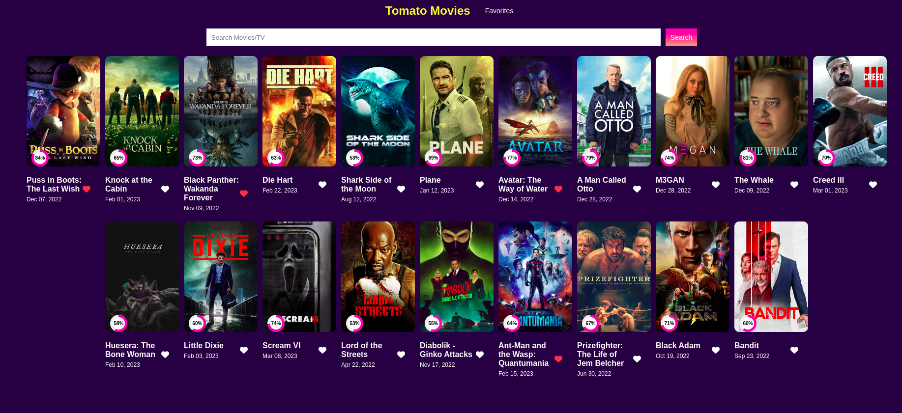
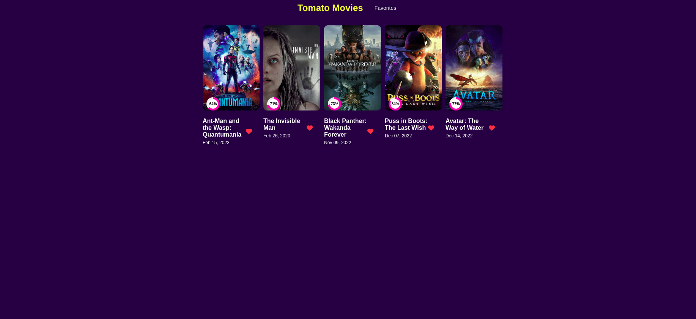
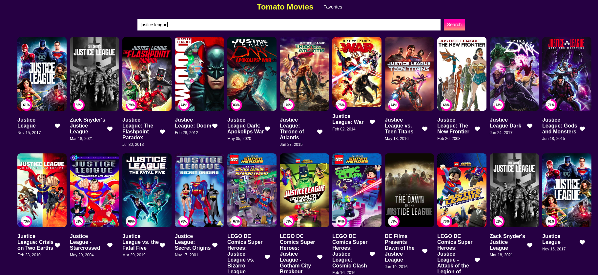

# Tomat Movies [IMDB CLONE] [Responsive]

Search your movies, get its complete movie information and cast information.
You can mark any movie as favorite and can track it in favorites section.

## What's inside?

- There is a input field to search any movies.

[Note]
- -  Currently this API do not include web series information
- - There are so many endpoints in TMDB API , but included as comment in JS File.
- - Just for the simplicity of the project.

- Search search is shown on click enter or input field changes.
- A heart shape icon is there below every movie to mark it as favorite.
- To make data persist, I used browsers local storage.
- - The Aim of the project is to make it as a static website.

## Screenshots

## Authors

- [@ujjawalbiswas](https://www.linkedin.com/in/ujjawal-biswas-b40611142/)

## License

[MIT](https://choosealicense.com/licenses/mit/)